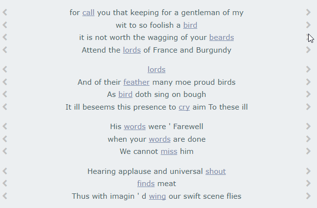

# Pataphysics; what the fuck?

[](http://creativecommons.org/licenses/by-nc/4.0/)


*a unique imaginary solution to the absence of problems*

<!--  -->


## Description

[pata.physics.wtf](http://pata.physics.wtf) is a poetic search engine, no more, no less.

### Academic Background

The system described and shown on this site is part of a PhD project entitled **Algorithmic Meta-Creativity** by Fania Raczinski. The doctoral thesis describing this project can be found at [dr.physics.wtf](http://dr.physics.wtf).

This research involves studying human and computer creativity and how they are evaluated, the absurd pseudo philosophy pataphysics and its applications, and the development of creative exploratory search algorithms inspired by pataphysical concepts.

- [Creative Zombie Apocalypse: A Critique of Computer Creativity Evaluation](http://ieeexplore.ieee.org/xpl/articleDetails.jsp?arnumber=7473036), International Symposium on Creative Computing 2016 in Oxford
- [The pataphysics of creativity: developing a tool for creative search](http://www.tandfonline.com/doi/full/10.1080/14626268.2013.813377#.U6li4_ldV8E), Digital Creativity journal 2013
- [Creative search using pataphysics](http://dl.acm.org/citation.cfm?id=2466648&CFID=824433372&CFTOKEN=80216159), Creativity & Cognition conference 2013 in Sydney
- [The Pataphysics of the Future](https://www.youtube.com/watch?v=UxYUZMyPE0o), talk at the TDC at DMU in 2013
- [Pata-computed Poetry](https://vimeo.com/142947457), talk at the Phoenix in Leicester as part of a Computer Arts Society 2015

A previous version of this prototype was used in the creation of an online opera entitled [*The Imaginary Voyage*](http://andrewhugill.com/theimaginaryvoyage/) and created in collaboration with The Opera Group, an award-winning, nationally and internationally renowned opera company. In particular, it was used to create the libretto for one of the virtual islands whose navigation provides the central storyline for the opera.


### Technical Details

In short, the tool reads in a library of plaintext files, and creates an index (a dictionary type data structure storing the vocabulary of the whole corpus together with a list that contains all documents and positions of the term within the document in the vocabulary). There are two collections of texts to choose from, either the Faustroll corpus or the Shakespeare corpus.

Index:
```
{
  word1: [[fileA, posa], [fileB, posb], ...], 
  word2: [[fileC, posc], [fileK, posk], ...],
  ... 
}
```

All texts in the corpus are read into memory and processed, for example, any stopwords of the source language are removed.

Once a user submits a query, various important functions are triggered. First, the three *patalgorithms* are run to populate a list of results to be rendered.

Each algorithm pataphysicalises the original query term in its own way and looks for matches in the index.

Results:
```
[(title, (pre, word, post), algorithm), ...]
```

Results are presented in one of three ways. The default is the poetry view. It displays 14 lines of text, each of which can be changed to another iff more results are available. This is heavily inspried by Raymond Queneau's *Cent mille milliards de poèmes*. The other two options show the results either sorted by their source or by the algorithm by which they were generated.


## Installation

I highly recommend experiencing the project on [pata.physics.wtf](http:pata.physics.wtf) rather than installing from the source.

### Prerequisites

Virtualenv is recommended but not required. If you don't want to use it, skip steps 1, 2 and 3.

1. install [Virtualenv](https://virtualenv.pypa.io/en/stable/)
2. create a virtual environment ```virtualenv venv```
3. activate virtual environment ```venv\scripts\activate```
4. install [Python 2.7](https://www.python.org/downloads/)
5. install dependencies ```pip install -r requirements.txt```

### Steps to run and stop

0. activate virtual environment ```venv\scripts\activate```
1. start project server ```python live.py```
2. open browser on 127.0.0.1:5000
3. enjoy the site
4. stop project server ```Ctrl + c```
5. deactivate virtual env ```deactivate```

You can also start a Gunicorn production server with ```gunicorn -c guni.py wsgi:app```, which starts the site on 127.0.0.1:8000.

## Usage

The site is split into 3 parts: text, image and video search. Results are displayed in various formats, one of which is the Queneau style poetry (see gif below).



Text search requires 1 keyword to produce results, whereas image and video search can handle multiple search terms.


## Credits

Fania Raczinski can be found at [fania.uk](http://fania.uk). Enquiries about this project can be sent to **pata@physics.wtf**.

## License


This work is licensed under the Creative Commons Attribution-NonCommercial 4.0 International License. To view a copy of this license, visit http://creativecommons.org/licenses/by-nc/4.0/ or send a letter to Creative Commons, PO Box 1866, Mountain View, CA 94042, USA.

## Acknowledgements

This work was completed at De Montfort University in Leicester, UK under the supervision of Prof. Hongji Yang, Prof. Andrew Hugill, Prof. Sophie Smith and Prof. Jim Hendler.


